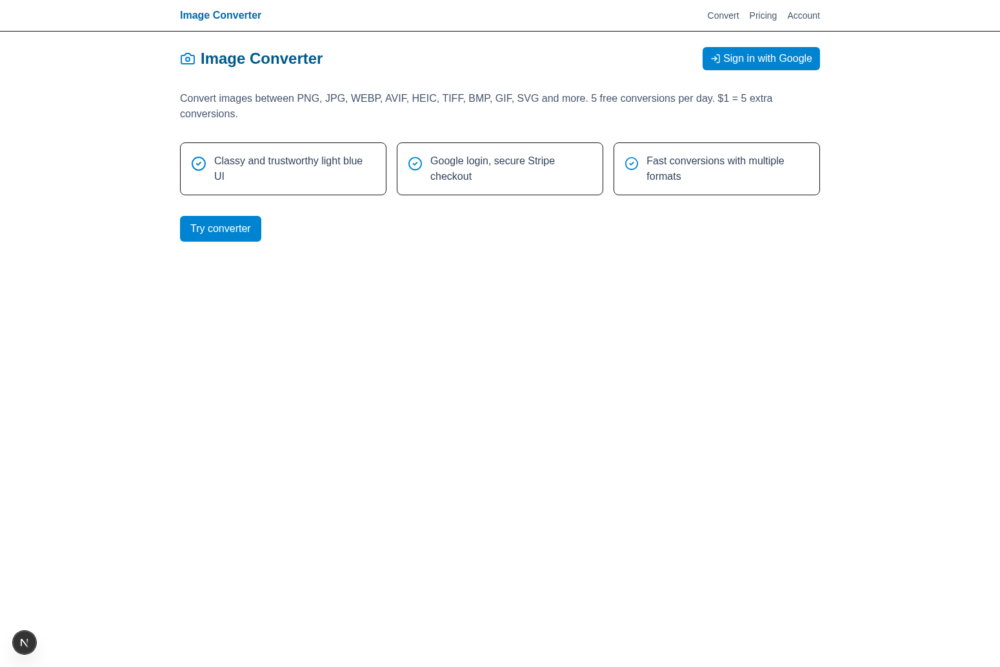

# 🖼️ Image Converter - Frontend



## 🚀 Next.js Frontend for Image Converter

This is the frontend application for the Image Converter, built with Next.js 15, TypeScript, Tailwind CSS, and NextAuth for authentication. It provides a modern, responsive interface for converting images between various formats.

## 📋 Prerequisites

### 🖥️ Windows Users
- **Node.js 20+** 📦
  - Download from [Node.js Official Website](https://nodejs.org/)
  - Choose the LTS version
  - Verify installation: `node --version` and `npm --version`
- **Git** 🔧
  - Download from [Git for Windows](https://gitforwindows.org/)
  - Verify installation: `git --version`

### 🍎 macOS Users
- **Node.js 20+** 📦
  ```bash
  # Using Homebrew (recommended)
  brew install node@20
  
  # Or download from Node.js website
  ```
- **Git** 🔧
  ```bash
  # Usually pre-installed, or install with Homebrew
  brew install git
  ```

## 🔧 Environment Setup

### 1. 📁 Clone the Repository
```bash
git clone https://github.com/raimonvibe/change-my-image.git
cd change-my-image/frontend
```

### 2. 📦 Install Dependencies

#### 🖥️ Windows (Command Prompt/PowerShell)
```cmd
npm install
```

#### 🍎 macOS (Terminal)
```bash
npm install
```

### 3. 🔑 Environment Configuration

Create a `.env.local` file in the frontend directory:

#### 🖥️ Windows
```cmd
# Create the file
echo. > .env.local
```

#### 🍎 macOS
```bash
# Create the file
touch .env.local
```

Add the following content to `.env.local`:
```env
NEXT_PUBLIC_API_URL=http://localhost:8080
NEXTAUTH_URL=http://localhost:3000
NEXTAUTH_SECRET=generate-a-random-secret-key-here
GOOGLE_CLIENT_ID=your-google-oauth-client-id
GOOGLE_CLIENT_SECRET=your-google-oauth-client-secret
```

## 🏃‍♂️ Running the Application

### 🖥️ Windows
```cmd
# Navigate to frontend directory
cd frontend

# Start development server
npm run dev
```

### 🍎 macOS
```bash
# Navigate to frontend directory
cd frontend

# Start development server
npm run dev
```

## ✅ Verification

Once the application starts successfully, you should see:
```
▲ Next.js 15.4.6 (Turbopack)
- Local:        http://localhost:3000
- Network:      http://[your-ip]:3000

✓ Ready in [time]ms
```

### 🔍 Test the Frontend
- **Homepage**: http://localhost:3000
- **Convert Page**: http://localhost:3000/convert
- **Pricing Page**: http://localhost:3000/pricing

## 🏗️ Application Architecture

### 📦 Key Technologies
- **Next.js 15** - React framework with App Router
- **TypeScript** - Type-safe JavaScript
- **Tailwind CSS** - Utility-first CSS framework
- **NextAuth** - Authentication library
- **Zustand** - State management
- **React Dropzone** - File upload component
- **Axios** - HTTP client
- **Lucide React** - Icon library

### 📁 Project Structure
```
frontend/
├── src/
│   ├── app/                 # App Router pages
│   │   ├── api/            # API routes
│   │   ├── convert/        # Convert page
│   │   ├── pricing/        # Pricing page
│   │   └── layout.tsx      # Root layout
│   ├── components/         # Reusable components
│   ├── lib/               # Utility functions
│   └── types/             # TypeScript types
├── public/                # Static assets
├── .env.local            # Environment variables
└── package.json          # Dependencies
```

### 🎨 Key Features
- **🖼️ Image Upload**: Drag & drop or click to select files
- **🔄 Format Conversion**: Support for JPG, PNG, WEBP, AVIF, HEIC, TIFF, BMP, GIF, SVG
- **⚙️ Quality Control**: Adjustable compression quality
- **🔐 Authentication**: Google OAuth integration
- **💳 Billing**: Stripe integration for premium features
- **📱 Responsive Design**: Works on desktop, tablet, and mobile

## 🔐 Configuration

### 🌍 Environment Variables
| Variable | Description | Required |
|----------|-------------|----------|
| `NEXT_PUBLIC_API_URL` | Backend API URL | ✅ |
| `NEXTAUTH_URL` | Frontend URL for NextAuth | ✅ |
| `NEXTAUTH_SECRET` | Secret for NextAuth sessions | ✅ |
| `GOOGLE_CLIENT_ID` | Google OAuth client ID | ✅ |
| `GOOGLE_CLIENT_SECRET` | Google OAuth client secret | ✅ |

### 🔧 Google OAuth Setup
1. Go to [Google Cloud Console](https://console.cloud.google.com/)
2. Create a new project or select existing one
3. Enable Google+ API
4. Create OAuth 2.0 credentials
5. Add authorized redirect URI: `http://localhost:3000/api/auth/callback/google`
6. Copy Client ID and Client Secret to `.env.local`

## 🎯 Available Scripts

```bash
# Development server with Turbopack
npm run dev

# Build for production
npm run build

# Start production server
npm start

# Run ESLint
npm run lint
```

## 🐛 Troubleshooting

### Common Issues

#### ❌ "Module not found" errors
```bash
# Clear node_modules and reinstall
rm -rf node_modules package-lock.json
npm install
```

#### ❌ Port 3000 already in use
**🖥️ Windows:**
```cmd
# Find process using port 3000
netstat -ano | findstr :3000
# Kill the process (replace PID)
taskkill /PID [PID] /F

# Or use different port
npm run dev -- -p 3001
```

**🍎 macOS:**
```bash
# Find and kill process using port 3000
lsof -ti:3000 | xargs kill -9

# Or use different port
npm run dev -- -p 3001
```

#### ❌ NextAuth configuration errors
- Ensure `NEXTAUTH_URL` matches your frontend URL
- Generate a secure `NEXTAUTH_SECRET`: `openssl rand -base64 32`
- Verify Google OAuth credentials are correct

#### ❌ API connection issues
- Ensure backend is running on http://localhost:8080
- Check `NEXT_PUBLIC_API_URL` in `.env.local`
- Verify CORS settings in backend

#### ❌ Build errors with TypeScript
```bash
# Check for type errors
npm run lint

# Fix common issues
npm run build
```

## 🎨 Customization

### 🎨 Styling
- Modify `tailwind.config.js` for custom themes
- Update global styles in `src/app/globals.css`
- Component styles use Tailwind utility classes

### 🔧 Configuration
- Update `next.config.js` for Next.js settings
- Modify `tsconfig.json` for TypeScript configuration
- Adjust ESLint rules in `.eslintrc.json`

## 📱 Browser Support

- ✅ Chrome 90+
- ✅ Firefox 88+
- ✅ Safari 14+
- ✅ Edge 90+

## 📚 Additional Resources

- [Next.js Documentation](https://nextjs.org/docs)
- [TypeScript Documentation](https://www.typescriptlang.org/docs/)
- [Tailwind CSS Documentation](https://tailwindcss.com/docs)
- [NextAuth Documentation](https://next-auth.js.org/)
- [React Documentation](https://react.dev/)

## 🤝 Contributing

1. Fork the repository
2. Create a feature branch
3. Make your changes
4. Test thoroughly
5. Submit a pull request

## 🚀 Deployment

### Vercel (Recommended)
1. Connect your GitHub repository to Vercel
2. Set environment variables in Vercel dashboard
3. Deploy automatically on push to main branch

### Other Platforms
- **Netlify**: Configure build command as `npm run build`
- **AWS Amplify**: Use the Next.js build settings
- **Docker**: Use the included Dockerfile for containerization

---

🎉 **Happy coding!** If you encounter any issues, please check the troubleshooting section or create an issue in the repository.
